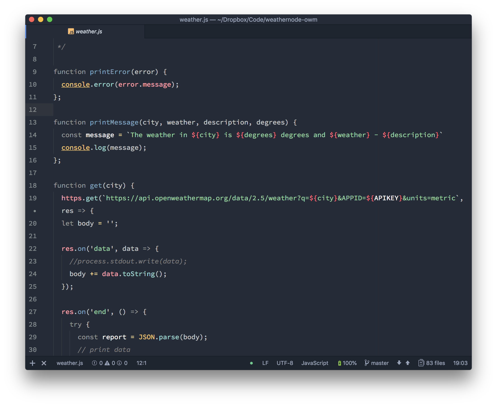
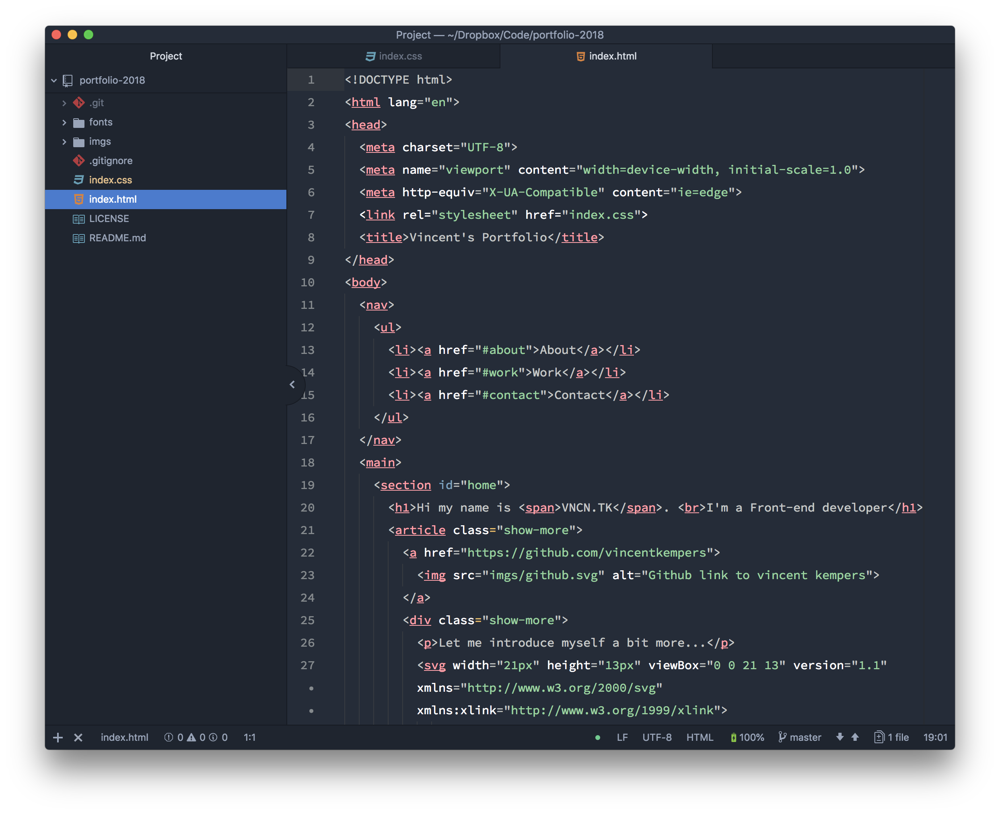
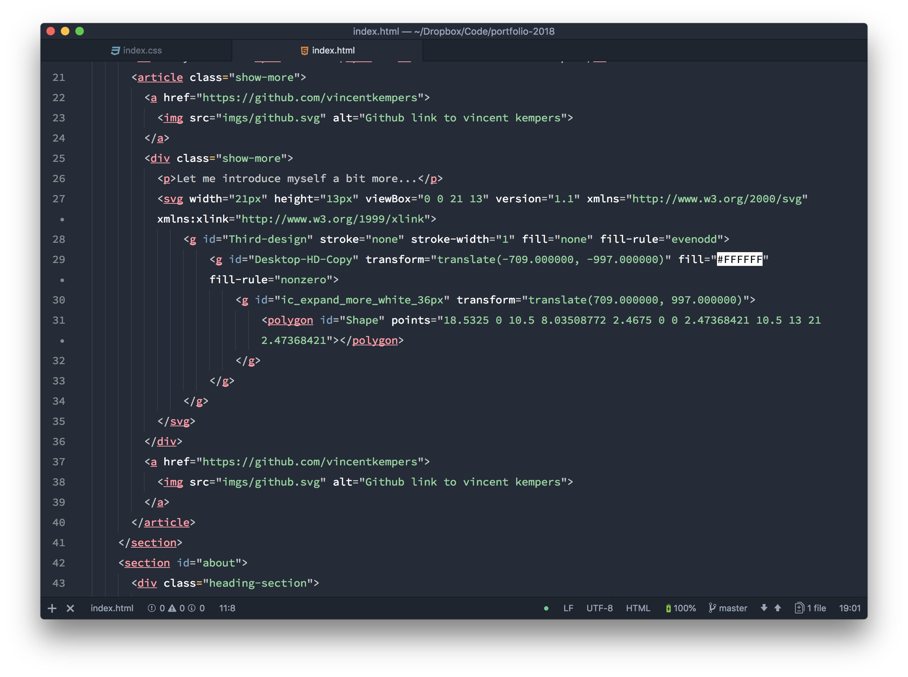

# GobGobGoo
A Simple Goooie syntax theme for Atom !


_Javascript_

_CSS_

_HTML_

# Installing
You can download this syntax theme:
* via `apm`
* via `install` switch to themes and type: `gobbiegobgoo`

# But i want this?
Are there things you would like to see, throw an issue!
_if somebody already threw an issue at it add a reaction or thumbs up_

# Customise
How I use this simple "gooie" goodness is with a bit of changing the line-height and having my font a bit bigger.

```JSON
editor:
  fontFamily: "Source Code Variable"
  fontSize: 15
  lineHeight: 1.9
  scrollPastEnd: true
  showIndentGuide: true
  softWrap: true
```

# Credits
[MIT](LICENSE)
