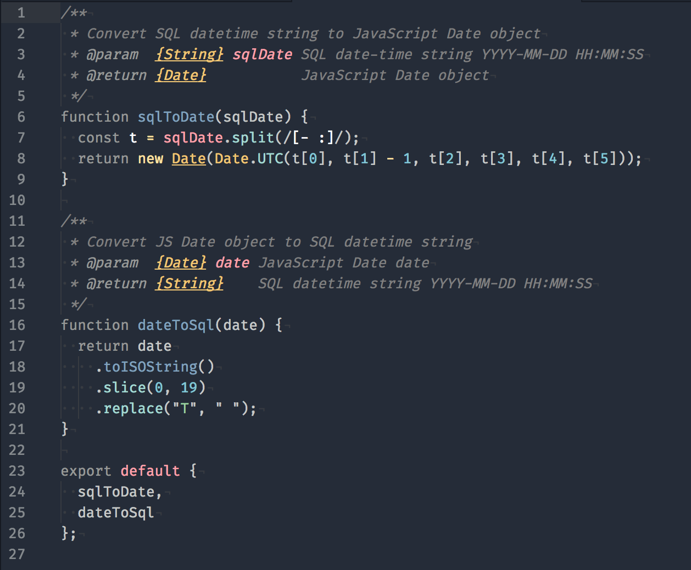
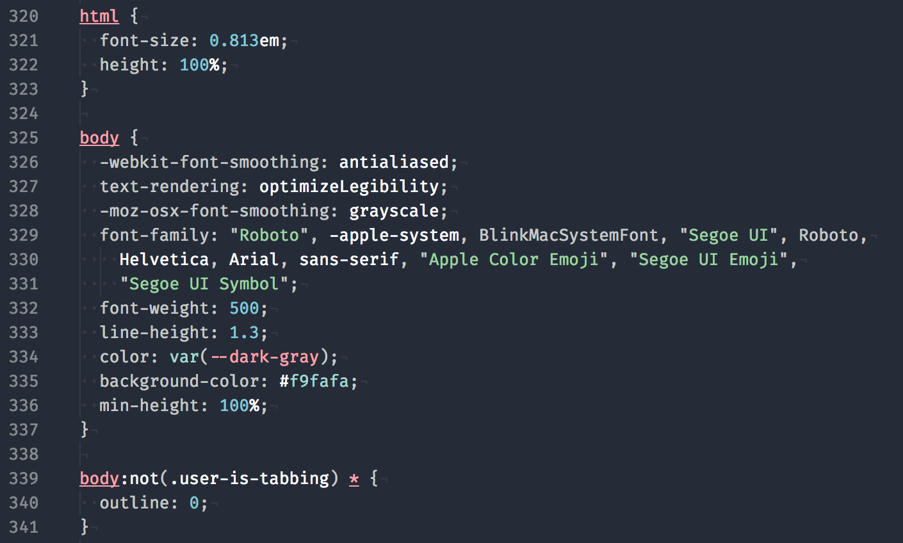
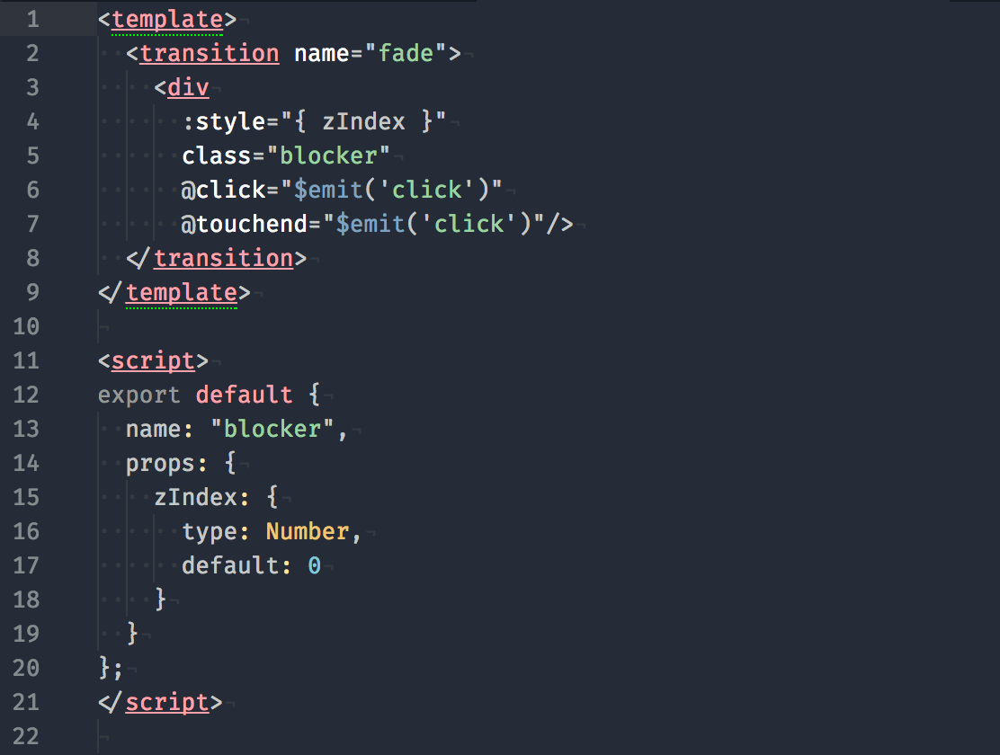
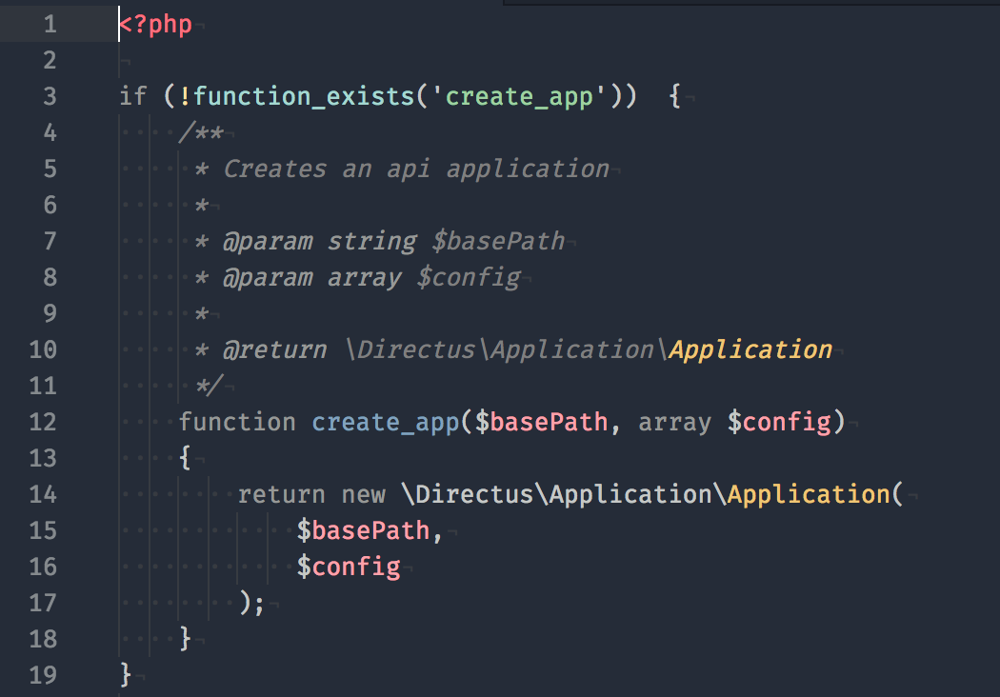

# Gobbie Gob Goo Syntax Theme

A simple _gooey_ syntax theme for Atom!


## Installation

Find this theme (`gobbiegobgoo`) in Atom's "Install" section. (Don't forget to toggle it to search for themes!), or run `apm install gobbiegobgoo`.

## Contributing

If they're things you'd like to see different in the theme, feel free to [shoot me an issue](https://github.com/VincentKempers/gobbie-gob-goo-syntax/issues/new/choose)!

## Customization

I personally like using this _gooey_ goodness using the following Atom config:

```json
editor:
  fontFamily: "Source Code Variable"
  fontSize: 15
  lineHeight: 1.9
  scrollPastEnd: true
  showIndentGuide: true
  softWrap: true
```

## Examples

### JavaScript



### CSS



### Vue



### PHP



## License

[MIT](LICENSE) &copy; [Vincent Kempers](https://github.com/VincentKempers)
