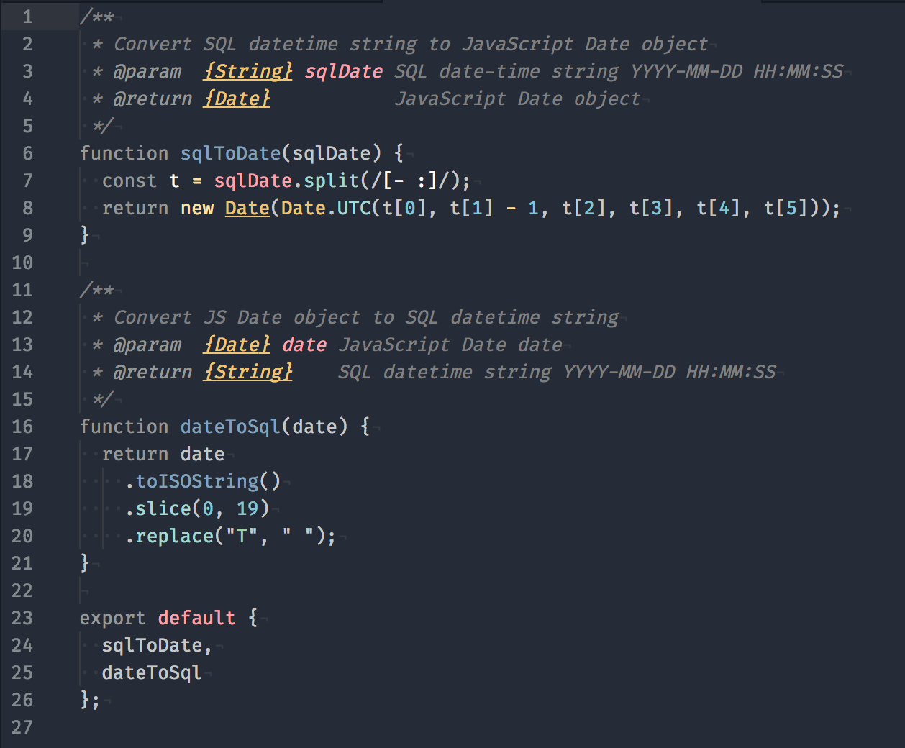
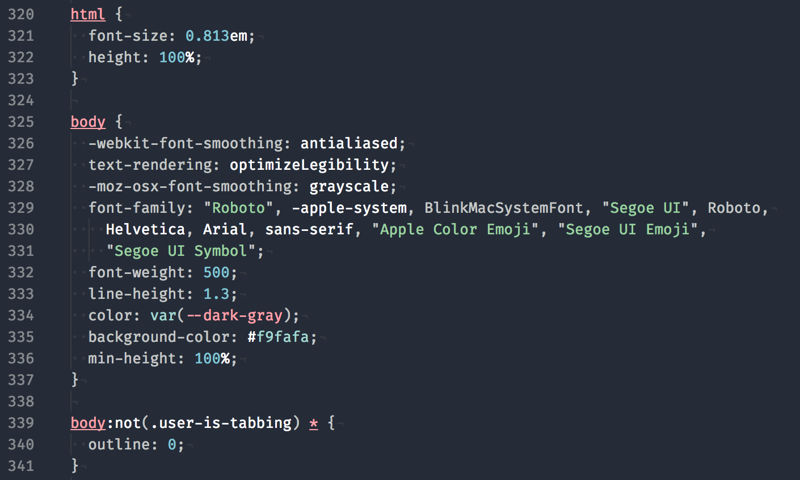
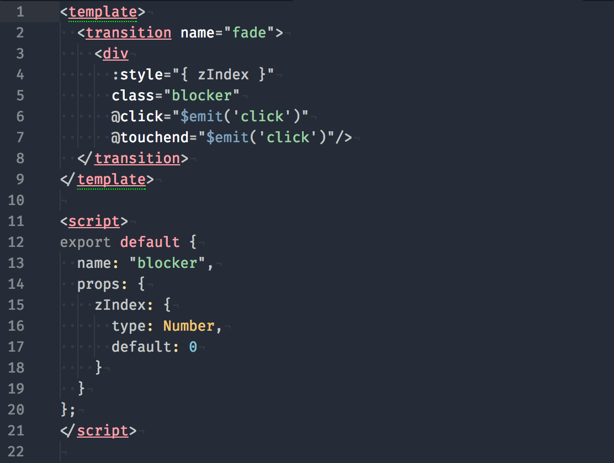
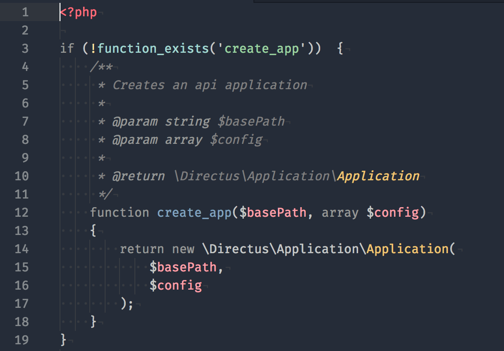

# Gobbie Gob Goo

A simple _gooey_ dark theme with a bit of light — revamped for **VS Code**, **Zed** and **Vim / Neovim**.

Originally an Atom syntax theme ([gobbie-gob-goo-syntax](https://github.com/VincentKempers/gobbie-gob-goo-syntax)). The palette is ported 1:1, including the Less `lighten()`/`darken()` derived colors.

## Project layout

```
src/
  palette.mjs   ← the colors (single source of truth, from the Atom colors.less)
  color.mjs     ← lighten/darken/alpha helpers matching Less
  vscode.mjs    ← VS Code: TextMate scopes, semantic tokens, workbench colors
  zed.mjs       ← Zed: tree-sitter captures and UI colors
  vim.mjs       ← Vim/Neovim: syntax groups, tree-sitter, LSP, xterm-256 fallbacks
scripts/build.mjs
vscode/         ← VS Code extension (generated theme in vscode/themes/)
zed/            ← Zed extension (generated theme in zed/themes/)
vim/            ← Vim/Neovim plugin (generated colorscheme in vim/colors/)
```

Edit files in `src/`, then regenerate all themes:

```sh
npm run build
```

Don't hand-edit the files in `vscode/themes/`, `zed/themes/` or `vim/colors/`. The build overwrites them.

## Install locally

### VS Code

```sh
npm run package:vscode          # creates vscode/gobbie-gob-goo-2.0.0.vsix
code --install-extension vscode/gobbie-gob-goo-2.0.0.vsix
```

Then run **Preferences: Color Theme**, then pick **Gobbie Gob Goo**.

### Zed

Either install it as a dev extension: open the command palette, run **zed: install dev extension** and pick the `zed/` folder.

Or copy only the theme file:

```sh
cp zed/themes/gobbie-gob-goo.json ~/.config/zed/themes/
```

Then run **theme selector: toggle**, then pick **Gobbie Gob Goo**.

### Vim / Neovim

With vim-plug: `Plug 'VincentKempers/gobbie-gob-goo-syntax', { 'rtp': 'vim' }`. Or copy `vim/colors/gobbie-gob-goo.vim` into `~/.vim/colors/` or `~/.config/nvim/colors/`. Then:

```vim
set termguicolors
colorscheme gobbie-gob-goo
```

See [vim/README.md](vim/README.md) for lazy.nvim.

## Publishing

- **VS Code Marketplace:** `cd vscode && npx @vscode/vsce publish` (needs a publisher account matching `publisher` in `vscode/package.json`). For Open VSX (VSCodium, Cursor, etc.): `npx ovsx publish`.
- **Zed:** open a PR on [zed-industries/extensions](https://github.com/zed-industries/extensions) that adds this repo as a submodule, with `path = "zed"` in `extensions.toml`.

## Differences from the Atom version

- Modern grammars use different scopes from Atom's, so the mappings follow how the theme *looked* in the screenshots below. Plain identifiers and parameters use the text color, object variables are pink, and types and tags are orange or pink with an underline.
- Zed themes can't underline tokens, so tags and types aren't underlined in Zed. (VS Code and Vim keep the underlines.)
- Vim has no transparency, so translucent colors such as search matches are pre-blended onto the background. Every color also has an xterm-256 fallback for terminals without truecolor.
- Atom left the UI to a separate UI theme. Every editor now gets matching UI colors (sidebars, tabs, status bars, terminal) built from the same palette.

## Customization

The Atom setup translated to VS Code `settings.json`:

```json
{
  "editor.fontFamily": "Source Code Pro",
  "editor.fontSize": 15,
  "editor.lineHeight": 1.9,
  "editor.renderWhitespace": "all",
  "editor.guides.indentation": true,
  "editor.wordWrap": "on"
}
```

And in Zed's `settings.json`:

```json
{
  "theme": "Gobbie Gob Goo",
  "buffer_font_family": "Source Code Pro",
  "buffer_font_size": 15,
  "buffer_line_height": { "custom": 1.9 },
  "show_whitespaces": "all",
  "soft_wrap": "editor_width"
}
```

## Examples (original Atom screenshots)






## License

[MIT](LICENSE) &copy; [Vincent Kempers](https://github.com/VincentKempers)
